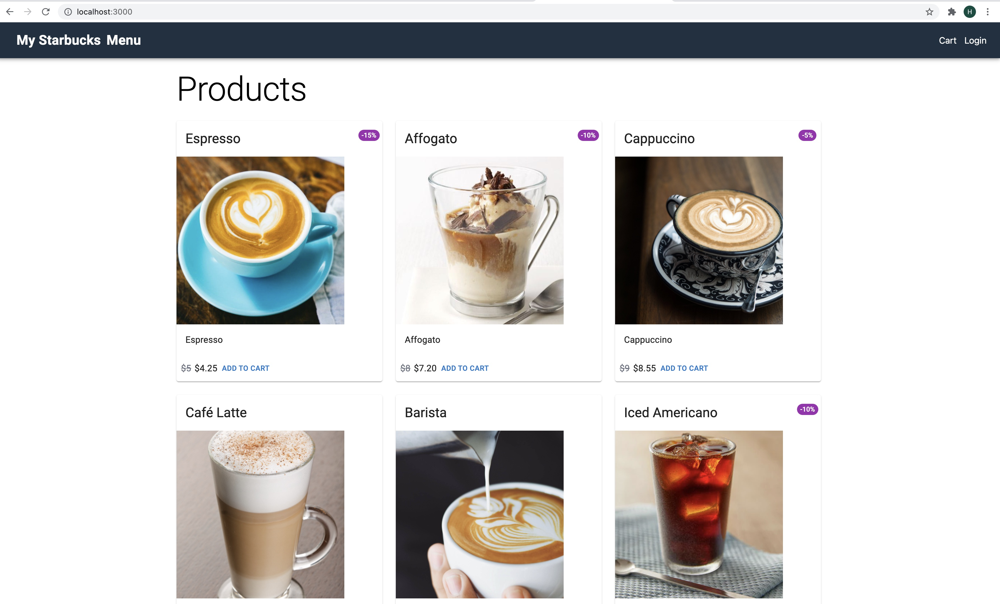
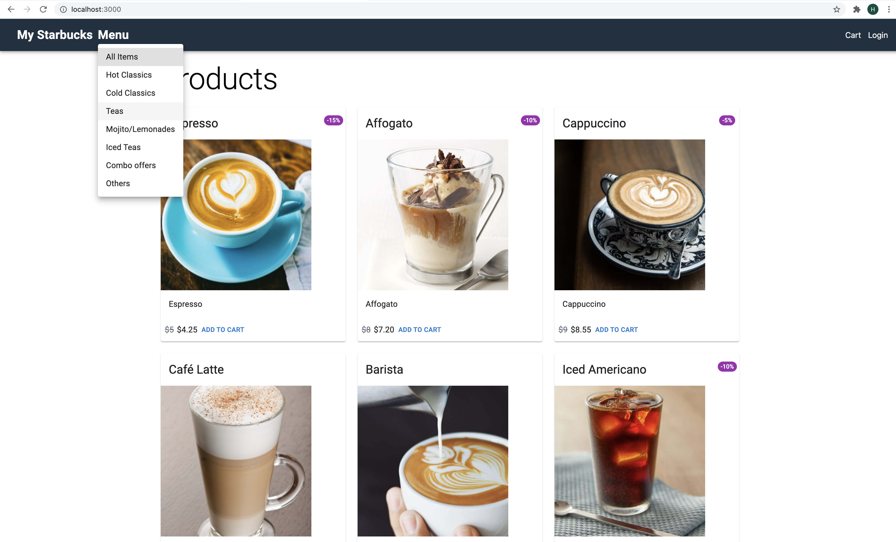
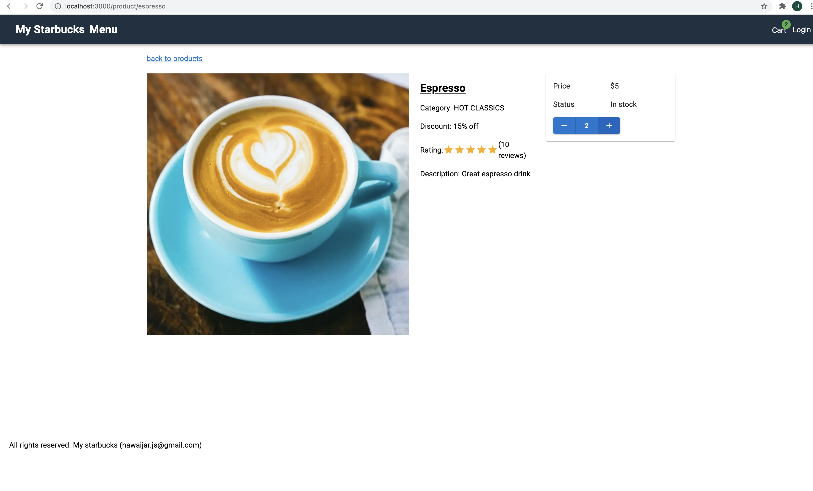
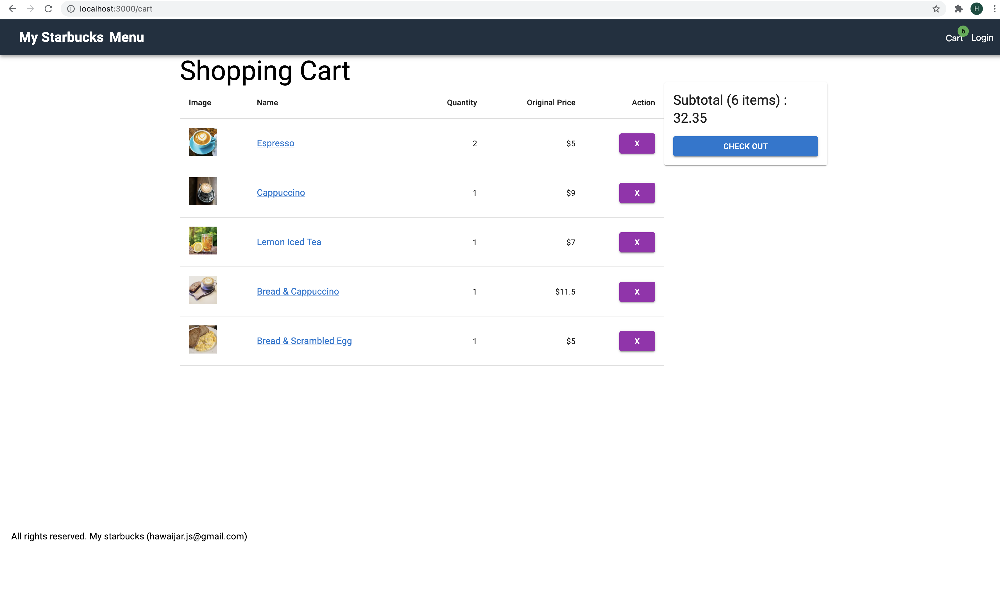
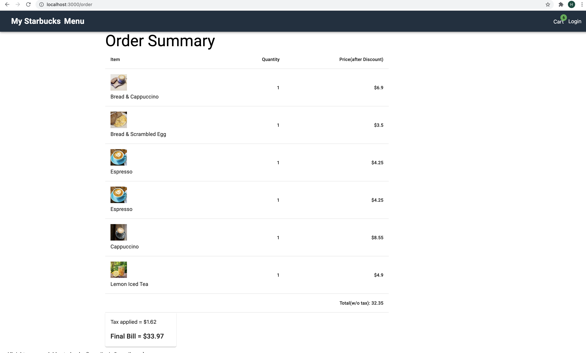

This is a [Next.js](https://nextjs.org/) project bootstrapped with [`create-next-app`](https://github.com/vercel/next.js/tree/canary/packages/create-next-app).

## Getting Started

First, run the development server:

```bash
npm run dev
# or
yarn dev
```

Open [http://localhost:3000](http://localhost:3000) with your browser to see the result.

## Main page
When we run the app, we'll be seeing all the products as shown below -



## Menu List
On the menubar is the **Menu** link and clicking on that will display all the categories of coffees available to be selected.
They are acting as the filter to select a particular group of product items.



## Adding products on the Cart
We can add a product (to the Cart) by clicking the  *ADD TO CART* link in each product.



## Shopping Cart
When we add products, the **Cart** menu will display a badge showing total count of selected products. Clicking on it will display the list of selected products. Clicking



## Order Summary
Clicking the *Checkout* link on the Shopping Cart page will display the final order details of selected products. Clicking



Note: Discounts are calculated based on the given requirement that when there is an overlapping discounts happened, *only the highest one shall be selected*.
E.g. if we select Bread, cappuccino, Scrambled Egg, only *Bread and cappuccino* will be given discount as they are giving the highest discount (40%) and Scrambled Egg will be individually charged.
